# Borrow Something!
This project is a Django based website that allows users to register and request to borrow an item (e.g.: A lawnmower, paint stripper etc.) from someone nearby.  
Other users can view requests and choose to respond with details about what they are able to lend to the requester.  
The requester can then review responses and choose to accept or reject them.  
Once a borrowing has been completed, the lender can rate the borrower to let other users know if the borrowing went OK.  
The site can be viewed at [Heroku Deployment](https://borrow-something.herokuapp.com/)

# Table of Contents
- [Borrow Something!](#borrow-something)
- [Table of Contents](#table-of-contents)
- [Design](#design)
  - [User Stories](#user-stories)
  - [Site Wireframes](#site-wireframes)
- [Features](#features)
  - [Navigation bar](#navigation-bar)
  - [Index Page](#index-page)
  - [Authentication](#authentication)
  - [Raise Requests](#raise-requests)
  - [View Request Details](#view-request-details)
  - [Accepting a Response](#accepting-a-response)
  - [View Own Raised Requests](#view-own-raised-requests)
- [Future Developments](#future-developments)
- [Testing](#testing)
- [Validation](#validation)
- [Deployment](#deployment)
  - [Prerequisites](#prerequisites)
  - [Instructions](#instructions)
- [Credits](#credits)

#  Design
## User Stories
- __As a user of the website I want to:__
  - Be able to sign up to the site.
    - After registering, login to the site with the same credentials on subsequent visits.
  - Manage requests to borrow something:
    - Create a new request, detailing:
      - What I want to borrow.
      - When I want to borrow it.
      - How long I want to borrow it for.
    - Accept responses to my requests to let the other user know I'd like to borrow their item.
    - Cancel my requests if I no longer need them.
  - View requests posted by other users.
  - Respond to requests from other users and let them know what I can lend them.

## Site Wireframes
**Index Page**  
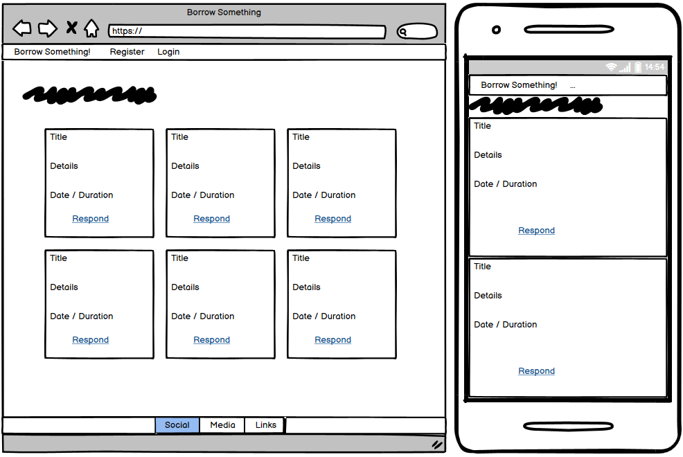  
**View Own Request Details Page**  
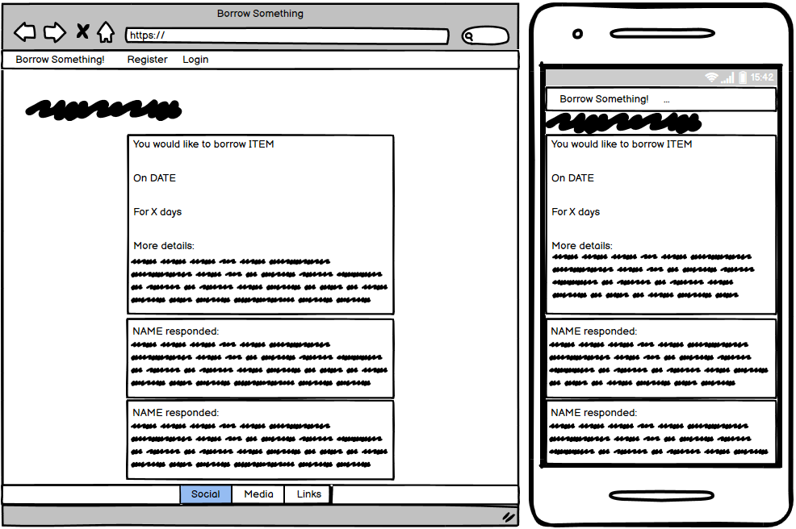  
**View Another Person's Request Details Page**  
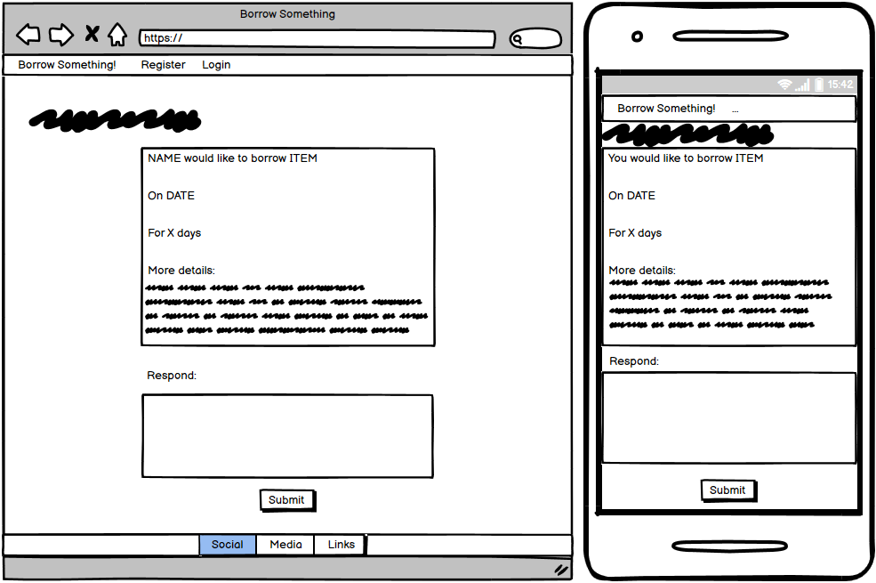  

# Features
## Navigation bar
The site features a responsive navigation bar, with the site name (Borrow Something!) as a link back to the index page.  
  
At smaller screen sizes, the menu collapses into a button that can be clicked to expand and show the menu options:  
  
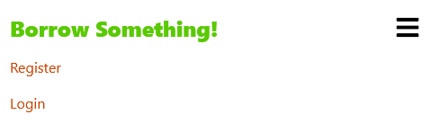  
When a user has logged in to the site, the branding updates to include their name, and a link to view their active requests:  
  
## Index Page
The default index page that users are presented with shows all available requests that have not had an accepted response:  
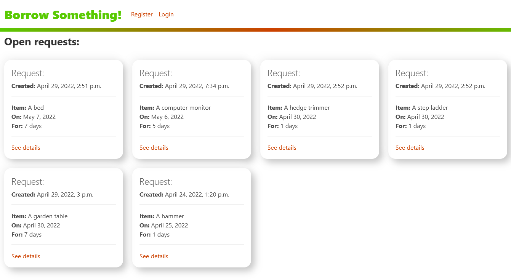  
This page adjusts the columns shown to the user to adapt to the screen size of their device:  
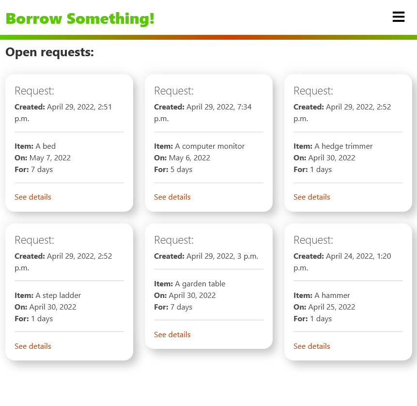  
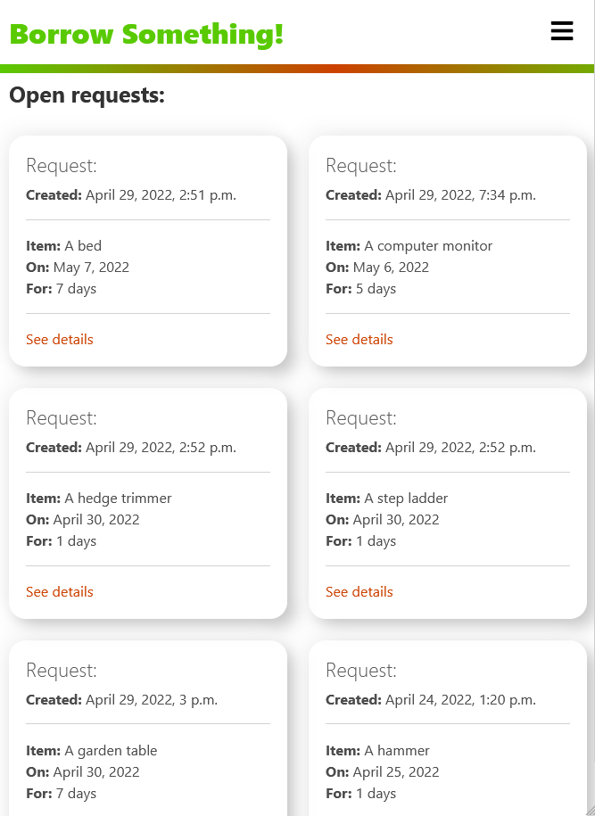  
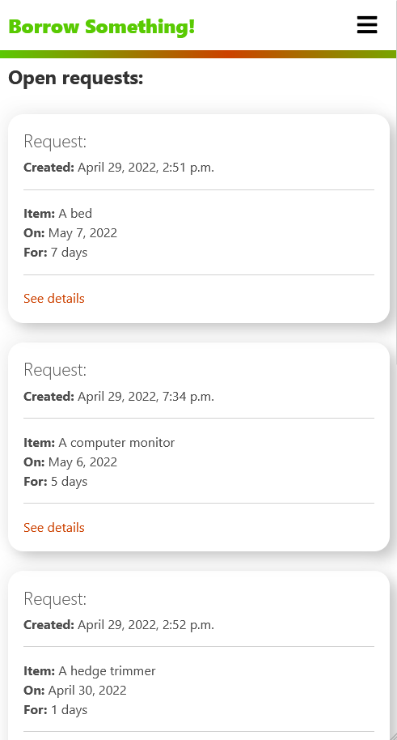  
When a user is logged in, their own requests are hidden from the page:  
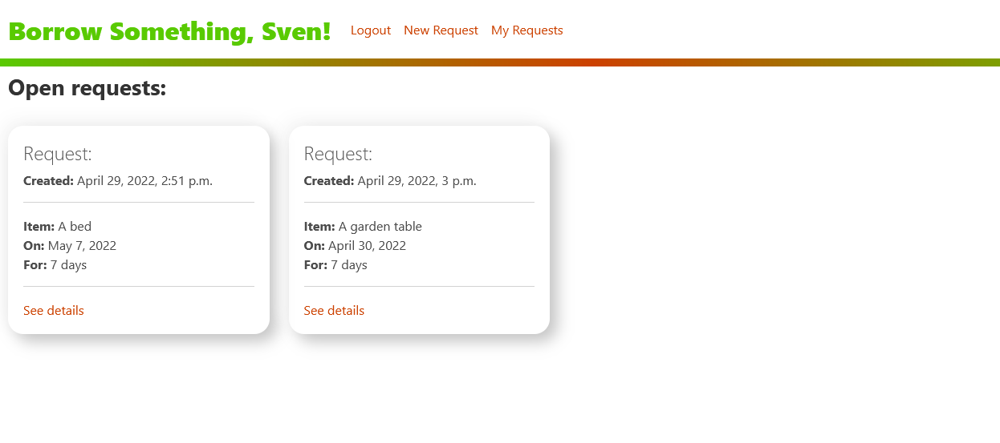  
## Authentication
To make full use of the site, the user is required to register, which then allows the user to:
- Raise new requests.
- Cancel their requests.
- Respond to other users' requests.
- Accept responses to their requests from other users.  

To test the functionality of the site, you should register 2 separate user accounts (use 2 different browsers to make this simpler and have both accounts signed in at once).  
This will enable you to create and respond to requests easily.
## Raise Requests
If the user wants to raise a request to borrow something they need, they can click the "New Request" button that is visible after signing up and logging in:  
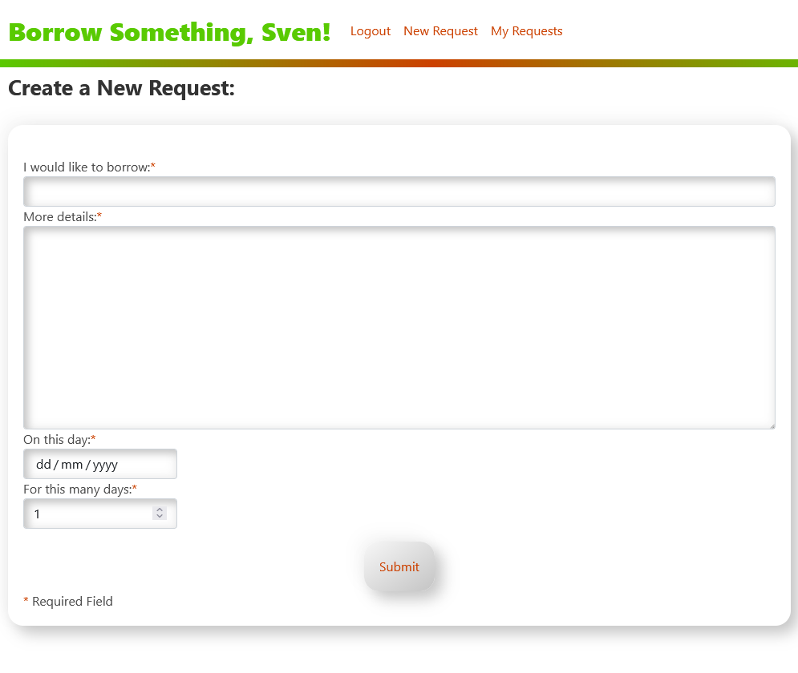  
The user can then enter:
- The name of the object they wish to borrow.
- Some more information to describe what they wish to borrow.
- The date they need to borrow the item.
- How long they wish to borrow it for.  

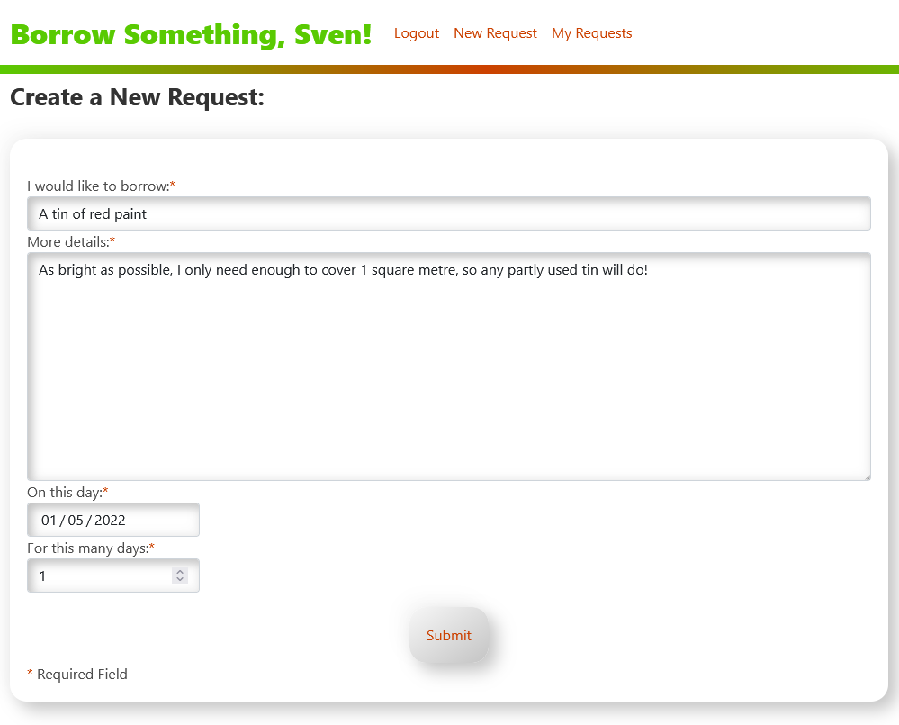  
On clicking "Submit", the entry is saved to a database and can be viewed by other users.  
## View Request Details
By clicking the "See Details" button on a request, the user is taken to the full details for the request.  
If the request is owned by the logged in user, they can see any responses to their request, and choose to accept any responses or cancel the request:  
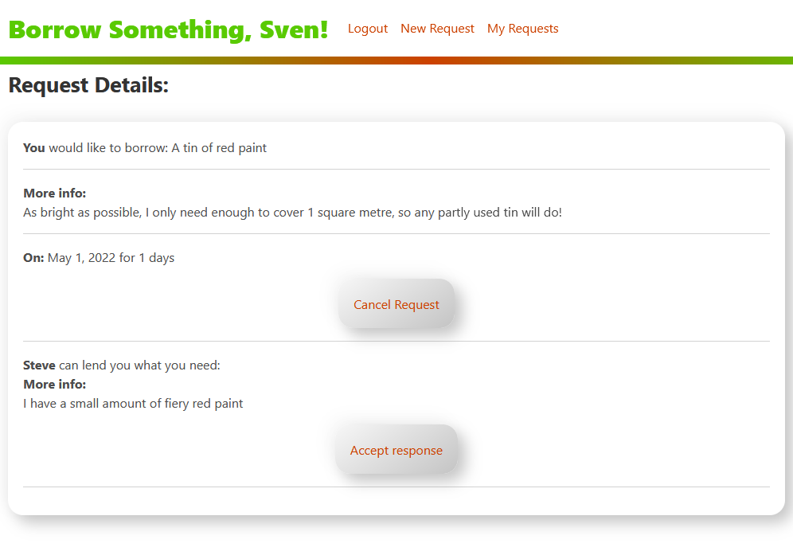  
If the request was raised by someone else, the user will see a form to provide a response to the user where they can enter details about what they can lend:  
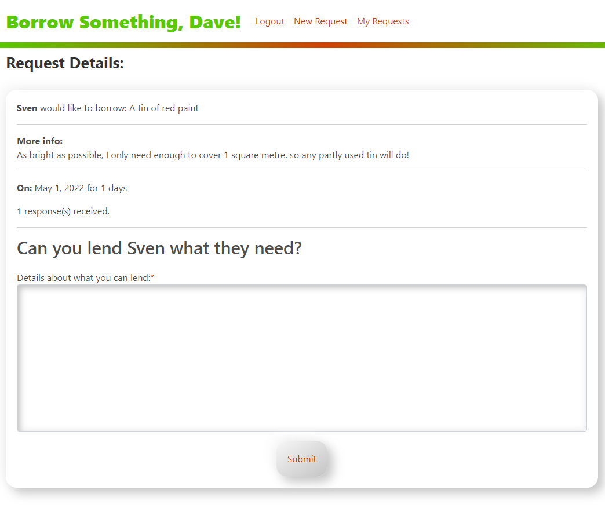  
## Accepting a Response
If a user wishes to accept a response to their request, they can click the "Accept Response" button on their request.  
The request will no longer be displayed for other users to view.  
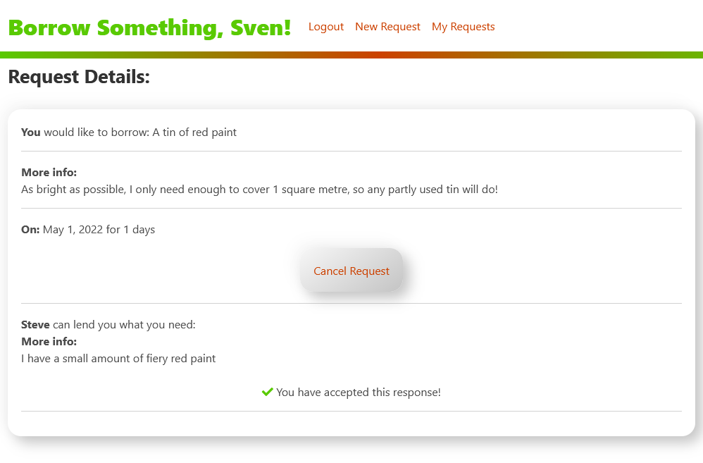  
## View Own Raised Requests
Clicking on the "My Requests" button takes the user to a page where they can see all their own requests, and click "See Details" on any to be taken to the further details page.  
The user is shown which of their requests are active and which they have cancelled.  
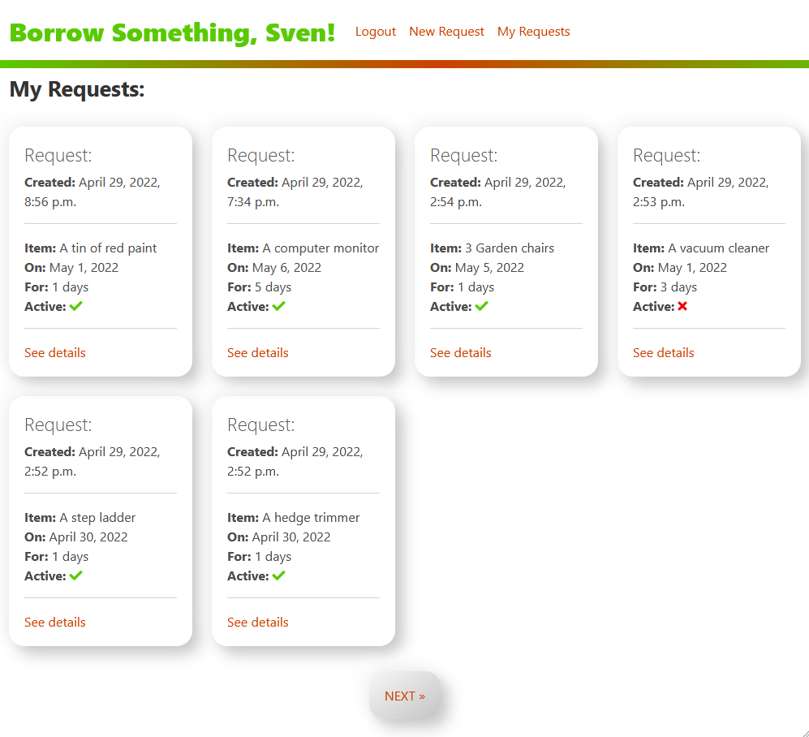  
# Future Developments
To enhance the project in the future, the following features are planned:  
- When accepting a response on a request, send an email to the responder with contact details etc. in to allow the users to meet up and lend items.  
- Mark a request as "complete" when the item has been lent and subsequently returned.  
- Allow the user who lent an item to rate the borrower, allowing other users to decide whether to trust them with a lent item or not.  
# Testing
- __User Story Testing__
  - **Requirement**: Be able to sign up to the site.
    - The site features sign up, login and logout functionality, allowing users to register and use the features of the site.
  - **Requirement**: Manage requests to borrow something:
    - **Requirement**: Create a new request:
      - After registering and authenticating with the site, the user can create a new request with all requested functionality.  
    - **Requirement**: Accept responses to my requests to let the other user know I'd like to borrow their item.
      - Users can view their requests and any responses, and accept the response they prefer.  
    - **Requirement**: Cancel my requests if I no longer need them.
      - The user can choose to cancel their request at any time and it will no longer be visible by other users.  
  - **Requirement**: View requests posted by other users.
    - All non-cancelled requests from other users are visible on the index page of the site.  
  - **Requirement**: Respond to requests from other users and let them know what I can lend them.
    - Once authenticated on the site, the user can view the details for a request, and enter a typed out response to the user, letting them know what they can lend.

# Validation

# Deployment
## Prerequisites
- Generate a [Django secret key](https://miniwebtool.com/django-secret-key-generator/) 
## Instructions
- Create a local copy of the GitHub repository, by following one of the 2 processes below:
    - Download code:
        - Go to the [GitHub Repo](https://github.com/SiJiL82/borrow_something) page.
        - Click the `Code` button and download the ZIP file containing the project.
        - Extract the ZIP file to a location on your PC.
    - Clone the repository:
        - Open a terminal to the location you wish to run the application from.
        - Run the command `git clone https://github.com/SiJiL82/borrow_something.git`
- Create a new Python virtual environment:
  - `python3 -m venv venv`
  - `source venv/bin/activate`
- Install requirements:
  -  `pip3 install requirements.txt`
- Create a [Heroku](https://www.heroku.com) account if you don't already have one.
- Create a new Heroku application
- Add environment variables to Heroku config vars:
  - Add steps here
- In a terminal inside your copy of the project repository:
  - Login to Heroku `heroku login`
  - Set Heroku as remote repository `heroku git:remote -a APP_NAME`
  - Push code to Heroku `git push heroku main`

# Credits
- [Neumorphism.io](https://neumorphism.io) to generate CSS styling of site elements.  